# Spring Security

# 1. Spring Security快速入门  
## 1.1 基本概念
- 什么是认证：即输入账号密码登录，系统判断用户身份是否合法的过程。
- 什么是会话：为了避免每次访问都需要登录，可以将用户信息保存在会话中，就不用多次认证了（除了比较敏感的操作，如：支付）。
  - 基于session的认证：用户认证成功后，服务器将用户信息保存在session（当前会话）中。
  - 基于token的认证：用户认证成功后，服务端生成一个token给客户端，这个token可以保存在cookie中或者其他存储空间中，客户端之后的请求头加上token，服务端验证token来确认用户身份。
- 什么是授权：授权是在认证后发生的，根据用户权限来控制访问不同资源。
  - 授权的数据模型（可以理解为who对what进行how操作）
    - who：即主体，一般指用户
    - what：即资源，如商品信息等 
    - how：权限/许可，如用户查询权限
    - 主体、资源、权限关系：
      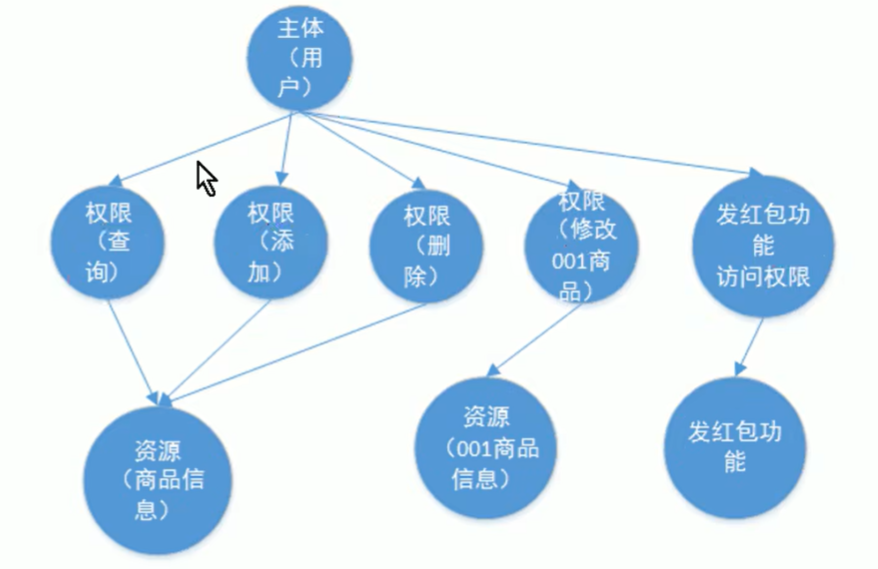
      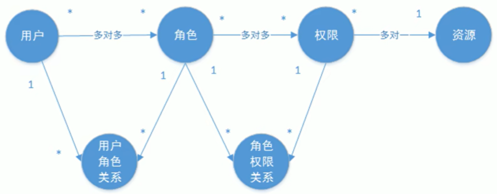
    在日常开发中可以将资源和权限合并
  
      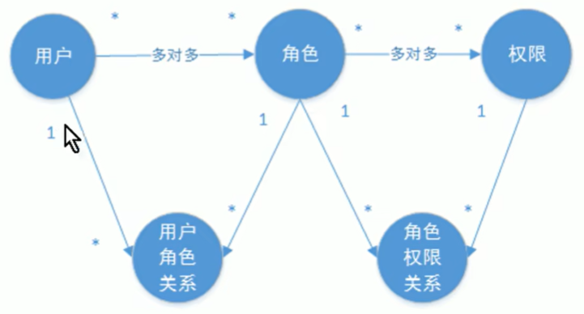
  
      那么需要最少设计5张表  
- RBAC：授权
  - 基于角色的访问控制（Role-Based Access Control）：即按角色进行授权
    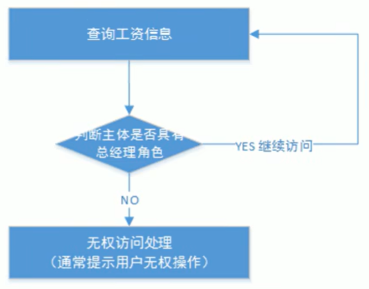
  
    在业务代码中可以这样写：
    ```
    //伪代码
    if(主体.hasRole("总经理角色id")){
      查询工资;
    }
    ```
    如果扩展，让部门经理也可以查工资，则需要改动代码：
    ```
    //伪代码
    if(主体.hasRole("总经理角色id") || 主体.hasRole("部门经理角色id")){
      查询工资;
    }
    ```
    这样看，当授权角色发生变化时，需要修改代码，可扩展性差。
  - 基于资源的访问控制（Resource-Based Access Control）：即按资源进行授权【推荐】
  
    如果这个人有查询工资的权限，就可以查询工资
  
    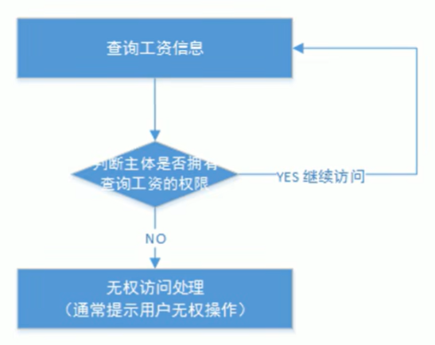
  
    伪代码可以是：
    ```
    if(主体.hasPermission("查询工资权限标识")){
      查询工资
    }
    ```
## 1.2 基于Session的认证方式
### 1.2.1 认证流程
采用了servlet规范，具体流程：客户端发起请求，服务端生成session，并将sessionId传给客户端，客户端将sessionId保存到cookie中，再次请求时将携带sessionId。如果session过期销毁，客户端将无法通过校验。

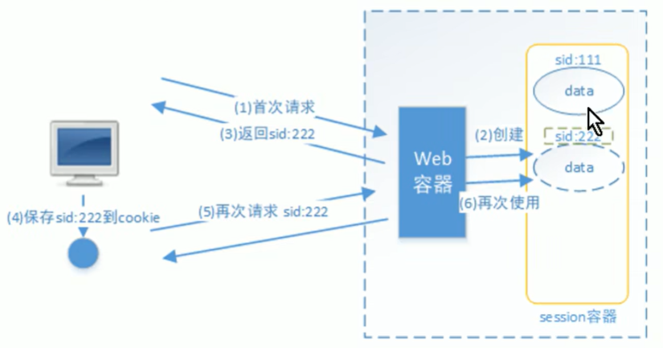


-----

## 1.1 基本功能
- 身份认证：即登录
- 授权：使得用户无法访问未授权的资源
- 防御常见攻击
  - CSRF
  - HTTP Headers
  - HTTP Requests


## 1.4 身份认证
### 1.4.1 实现最简单的身份认证
参考官方代码示例：https://github.com/spring-projects/spring-security-samples

spring security默认情况下会自动生成一个登录页，将url重定向到登录页。用户名默认是：user，密码会打印在控制台。
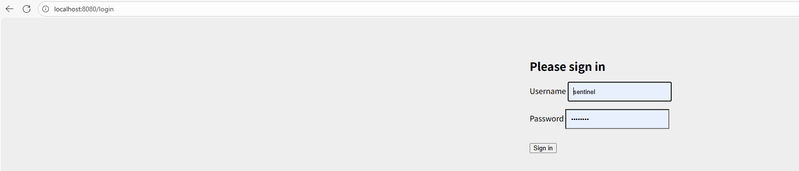
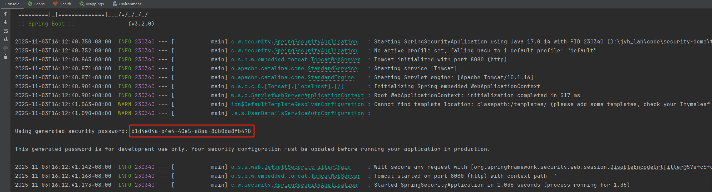
登录成功后：

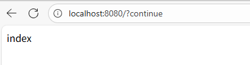

## 1.5 spring security的底层原理
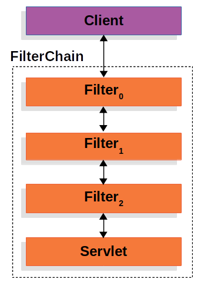

spring security的底层是由servlet过滤器实现的。
 
## 1.6 程序的启动和运行

### 1.6.1 DefaultSecurityFilterChain
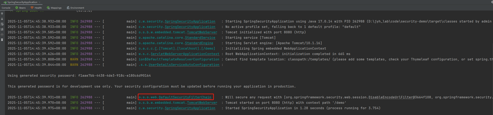
启动程序后，可以查看到日志，包含DefaultSecurityFilterChain
```
Will secure any request with [
org.springframework.security.web.session.DisableEncodeUrlFilter@3664f108, 
org.springframework.security.web.context.request.async.WebAsyncManagerIntegrationFilter@77dba4cd, 
org.springframework.security.web.context.SecurityContextHolderFilter@58c1da09, 
org.springframework.security.web.header.HeaderWriterFilter@3468ee6e, 
org.springframework.web.filter.CorsFilter@34a2d6e0, 
org.springframework.security.web.csrf.CsrfFilter@3b7eac14, 
org.springframework.security.web.authentication.logout.LogoutFilter@3f362135, 
org.springframework.security.web.authentication.UsernamePasswordAuthenticationFilter@286090c, 
org.springframework.security.web.authentication.ui.DefaultLoginPageGeneratingFilter@47e51549, 
org.springframework.security.web.authentication.ui.DefaultLogoutPageGeneratingFilter@2525a5b8, 
org.springframework.security.web.authentication.www.BasicAuthenticationFilter@7d979d34, 
org.springframework.security.web.savedrequest.RequestCacheAwareFilter@58d6e55a, 
org.springframework.security.web.servletapi.SecurityContextHolderAwareRequestFilter@751ae8a4, 
org.springframework.security.web.authentication.AnonymousAuthenticationFilter@3458eca5, 
org.springframework.security.web.access.ExceptionTranslationFilter@463561c5, 
org.springframework.security.web.access.intercept.AuthorizationFilter@4fc5563d]
```
可以看到一共涉及16个过滤器实例。

通过打断点也可以发现
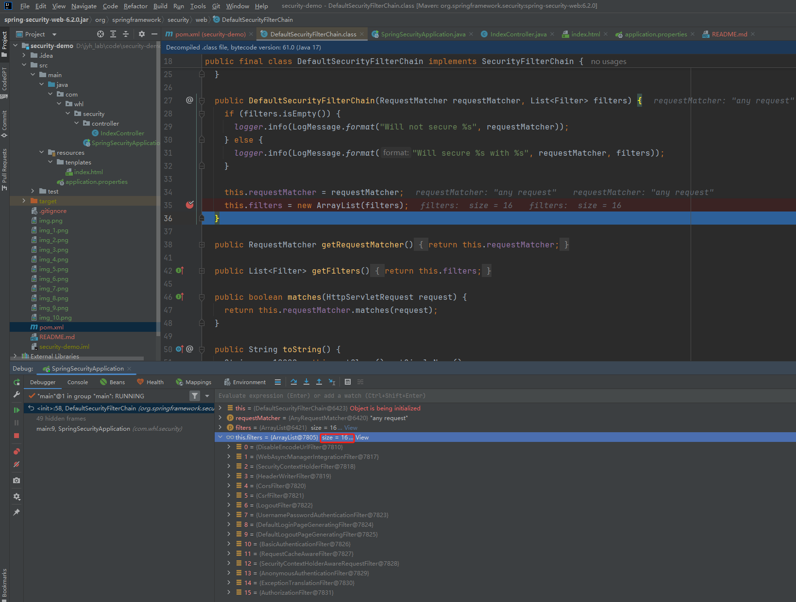

### 1.6.2 SecurityProperties
全局搜索`SecurityProperties`类，有个内部类`User`，可以看到默认的用户名是`user`，密码是`uuid`。
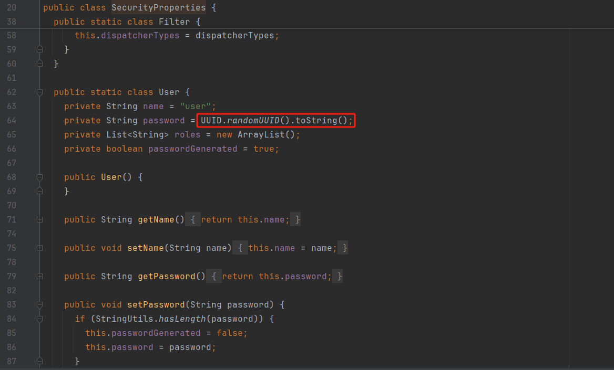
可以在application.properties中配置指定的账号密码。
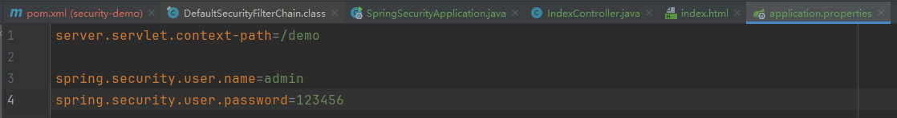


# 2. SpringSecurity自定义配置
## 2.1 基于内存的用户认证
### 2.1.1 Spring Security自定义配置

> 步骤
1. 自定义WebSecurityConfig类
  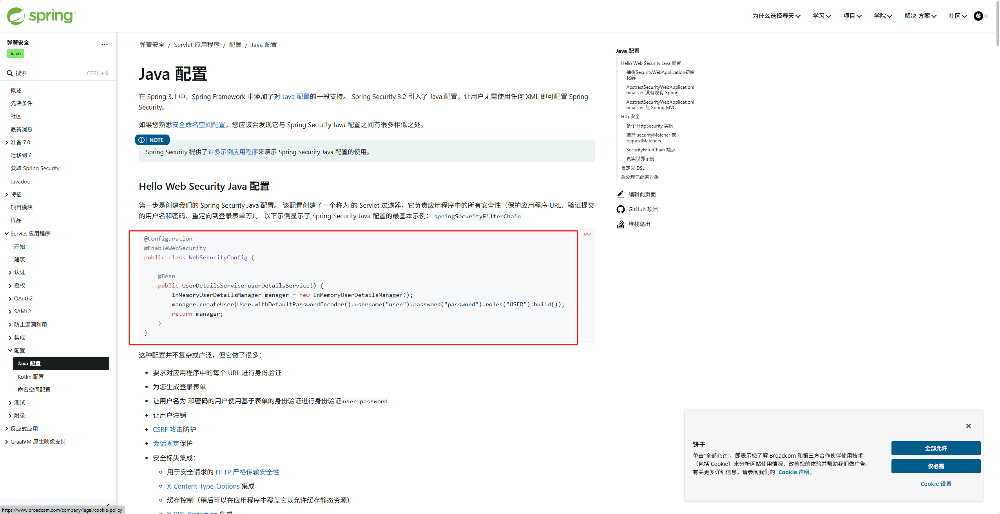

  ```java
  @Configuration //配置类
  //@EnableWebSecurity //开启spring security自定义配置（在springboot项目中可以省略此注解）
  public class WebSecurityConfig {
  
    @Bean
    public UserDetailsService userDetailsService() {
      // 创建基于内存的用户信息管理器
      InMemoryUserDetailsManager manager = new InMemoryUserDetailsManager();
  
      //使用manager来管理UserDetails对象
      manager.createUser(
              //创建UserDetails对象，用户管理用户名、用户密码、用户角色、用户权限等内容
              User.withDefaultPasswordEncoder()
                      .username("whl")
                      .password("password")
                      .roles("USER").build()
      );
  
      return manager;
    }
  }
  ```
  这是因为spring security依赖的`SpringBootWebSecurityConfiguration`类中已经引入过这个注解。
  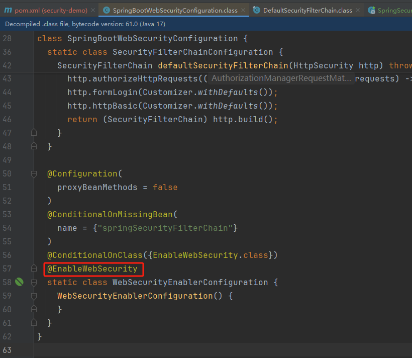
  
  UserDetailService接口下有很多实现类：
  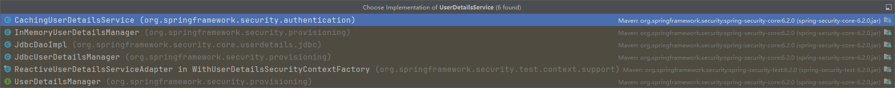
  把用户信息管理在spring security的内存中。

**注意，这样设置配置类后，生效的与用户名/密码就变成了配置类中的；application配置文件中的用户名/密码就不生效了。【也就是用自定义配置替换了默认配置】**

### 2.1.2 基于内存的用户认证流程
- 程序启动时：
  - 创建`InMemoryUserDetailsManager`对象
  - 创建`User`对象，封装用户名密码
  - 使用`InMemoryUserDetailsManager`将`User`存入内存
- 校验用户时：
  - SpringSecurity自动使用`InMemoryUserDetailsManager`的`loadUserByUsername`方法从**内存中**获取`User`对象
  - 在`UsernamePasswordAuthenticationFilter`过滤器中的`attemptAuthentication`方法中将用户输入的用户名密码及从**内存中**获取到的用户信息进行比较，进行用户认证。

## 2.2 基于数据库的数据源
创建数据库表
```sql
CREATE TABLE `user` (
  `id` int NOT NULL AUTO_INCREMENT,
  `username` varchar(50) DEFAULT NULL,
  `password` varchar(500) DEFAULT NULL,
  `enabled` tinyint(1) NOT NULL,
  PRIMARY KEY (`id`),
  UNIQUE KEY `user_username_uindex` (`username`)
) ENGINE=InnoDB AUTO_INCREMENT=4 DEFAULT CHARSET=utf8mb3;

INSERT INTO `user` (`username`, `password`, `enabled`) 
VALUES ('admin', '{bcrypt}$2a$10$Y47qB2ArzbrSjdD7kdelpORuftq0/k6c1ce.L36twxfHSH72mMV7y', true),
('Helen', '{bcrypt}$2a$10$Y47qB2ArzbrSjdD7kdelpORuftq0/k6c1ce.L36twxfHSH72mMV7y', TRUE),
('Tom', '{bcrypt}$2a$10$Y47qB2ArzbrSjdD7kdelpORuftq0/k6c1ce.L36twxfHSH72mMV7y', TRUE);
```
引入依赖
```xml
<!--mysql-->
<dependency>
  <groupId>mysql</groupId>
  <artifactId>mysql-connector-java</artifactId>
  <version>8.0.29</version>
</dependency>
<!--mybatis plus-->
<dependency>
  <groupId>com.baomidou</groupId>
  <artifactId>mybatis-plus-boot-starter</artifactId>
  <version>3.5.2</version>
</dependency>
<!--lombok-->
<dependency>
  <groupId>org.projectlombok</groupId>
  <artifactId>lombok</artifactId>
</dependency>
```
配置数据源
```properties
#MySQL
spring.datasource.driver-class-name=com.mysql.jdbc.Driver
spring.datasource.url=jdbc:mysql://localhost:3306/security-demo
spring.datasource.username=root
spring.datasource.password=password
#SQL日志
mybatis-plus.configuration.log-impl=org.apache.ibatis.logging.stdout.StdOutImpl
```
entity-mapper-service-controller层
```java
@Data
public class User {
  @TableId(value = "id", type = IdType.AUTO)
  private Integer id;

  private String username;

  private String password;

  private Boolean enabled;
}
```
```java
@Mapper
public interface UserMapper extends BaseMapper<User> {
}
```
```xml
<?xml version="1.0" encoding="UTF-8"?>
<!DOCTYPE mapper PUBLIC "-//mybatis.org//DTD Mapper 3.0//EN" "http://mybatis.org/dtd/mybatis-3-mapper.dtd">
<mapper namespace="com.whl.security.mapper.UserMapper">

</mapper>
```
```java
public interface UserService extends IService<User> {
}

```
```java
@Service
public class UserServiceImpl extends ServiceImpl<UserMapper, User> implements UserService {

}
```
```java
@RestController
@RequestMapping("/user")
public class UserController {
  @Resource
  public UserService userService;

  @GetMapping("/list")
  public List<User> getList() {
    return userService.list();
  }

}
```
测试接口，请求成功
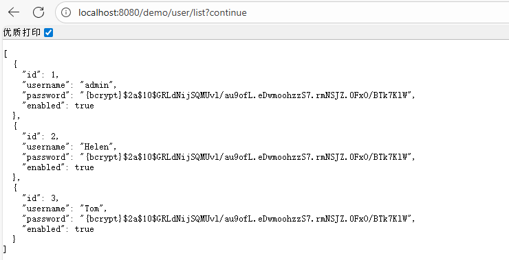

## 2.3 基于数据库的用户认证
### 2.3.1 基于数据库的用户认证流程
- 程序启动时：
  - 创建`DBUserDetailsManager`类，实现接口`UserDetailsManager`, `UserDetailPasswordService`【参考`InMemoryUserDetailsManager`的实现】。
  - 不需要创建用户对象，也不需要将用户对象放到内存中，用户数据已存在数据库中。
  - 在应用程序中初始化这个类的对象。
- 校验用户时：
  - SpringSecurity自动使用`DBUserDetailsManager`的`loadUserByUsername`方法从**数据库中**获取`User`对象。
  - 在`UsernamePasswordAuthenticationFilter`过滤器中的`attemptAuthentication`方法中将用户输入的用户名密码及从**数据库中**获取到的用户信息进行比较，进行用户认证。

### 2.3.2 定义DBUserDetailsManager
通过快捷键ctrl+H查看类的结构，如果持久层用的是mybatis/mybatis plus，就不能用`JdbcUserDetailsManager`【是基于SpringTemplate持久层的】
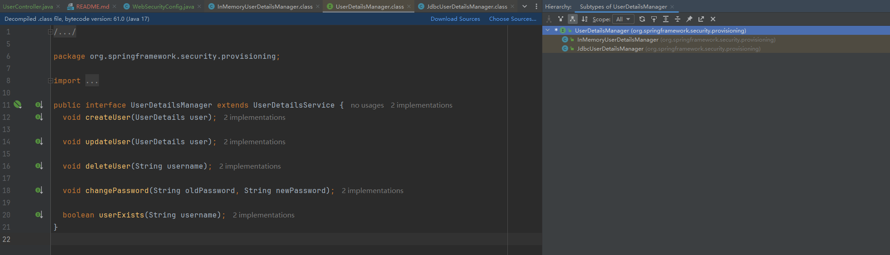
1. 编写`DBUserDetailsManager`类
```java
import com.baomidou.mybatisplus.core.conditions.query.QueryWrapper;
import com.whl.security.entity.User;
import com.whl.security.mapper.UserMapper;
import jakarta.annotation.Resource;
import org.springframework.security.core.GrantedAuthority;
import org.springframework.security.core.userdetails.UserDetails;
import org.springframework.security.core.userdetails.UserDetailsPasswordService;
import org.springframework.security.core.userdetails.UsernameNotFoundException;
import org.springframework.security.provisioning.UserDetailsManager;

import java.util.ArrayList;
import java.util.Collection;

public class DBUserDetailsManager implements UserDetailsManager, UserDetailsPasswordService {

  //引入持久层
  @Resource
  private UserMapper userMapper;

  @Override
  public UserDetails updatePassword(UserDetails user, String newPassword) {
    return null;
  }

  @Override
  public void createUser(UserDetails user) {

  }

  @Override
  public void updateUser(UserDetails user) {

  }

  @Override
  public void deleteUser(String username) {

  }

  @Override
  public void changePassword(String oldPassword, String newPassword) {

  }

  @Override
  public boolean userExists(String username) {
    return false;
  }

  /**
   * 通过用户名从数据库中获取用户信息.
   *
   * @param username 用户名
   * @return UserDetails对象
   * @throws UsernameNotFoundException
   */
  @Override
  public UserDetails loadUserByUsername(String username) throws UsernameNotFoundException {
    QueryWrapper<User> queryWrapper = new QueryWrapper<>();
    queryWrapper.eq("username", username);
    User user = userMapper.selectOne(queryWrapper);
    if (user == null) {
      throw new UsernameNotFoundException(username);
    } else {
      Collection<GrantedAuthority> authorities = new ArrayList<>();
      //组装security中的user对象
      return new org.springframework.security.core.userdetails.User(
              user.getUsername(),
              user.getPassword(),
              user.getEnabled(),
              true, //用户账号是否过期
              true, //用户凭证是否过期
              true, //用户是否未被锁定
              authorities //权限列表【暂时先创建空的】
      );
    }

  }
}
```
2. 编写针对`DBUserDetailsManager`的WebSecurityConfig方法
```java
@Configuration //配置类
public class WebSecurityConfig {

//  @Bean
//  public UserDetailsService userDetailsService() {
//    // 创建基于内存的用户信息管理器
//    InMemoryUserDetailsManager manager = new InMemoryUserDetailsManager();
//
//    //使用manager来管理UserDetails对象
//    manager.createUser(
//        //创建UserDetails对象，用户管理用户名、用户密码、用户角色、用户权限等内容
//        User.withDefaultPasswordEncoder()
//          .username("whl")
//          .password("password")
//          .roles("USER").build()
//    );
//
//    return manager;
//  }

  @Bean
  public UserDetailsService userDetailsService() {
    // 创建基于数据库的用户信息管理器
    DBUserDetailsManager manager = new DBUserDetailsManager();

    return manager;
  }
}
```
3. 测试，使用数据库中的账户密码登录
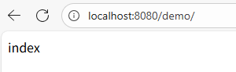

> 另外还有一种写法，去掉`WebSecurity`中的`userDetailsService`方法，`DBUserDetailsManager`上增加`@Component`注解，效果是一样的
```java
@Configuration //配置类
public class WebSecurityConfig {
}
```
```java
@Component
public class DBUserDetailsManager implements UserDetailsManager, UserDetailsPasswordService {

  //引入持久层
  @Resource
  private UserMapper userMapper;

  @Override
  public UserDetails updatePassword(UserDetails user, String newPassword) {
    return null;
  }

  @Override
  public void createUser(UserDetails user) {

  }

  @Override
  public void updateUser(UserDetails user) {

  }

  @Override
  public void deleteUser(String username) {

  }

  @Override
  public void changePassword(String oldPassword, String newPassword) {

  }

  @Override
  public boolean userExists(String username) {
    return false;
  }

  /**
   * 通过用户名从数据库中获取用户信息.
   *
   * @param username 用户名
   * @return UserDetails对象
   * @throws UsernameNotFoundException
   */
  @Override
  public UserDetails loadUserByUsername(String username) throws UsernameNotFoundException {
    QueryWrapper<User> queryWrapper = new QueryWrapper<>();
    queryWrapper.eq("username", username);
    User user = userMapper.selectOne(queryWrapper);
    if (user == null) {
      throw new UsernameNotFoundException(username);
    } else {
      Collection<GrantedAuthority> authorities = new ArrayList<>();
      //组装security中的user对象
      return new org.springframework.security.core.userdetails.User(
          user.getUsername(),
          user.getPassword(),
          user.getEnabled(),
          true, //用户账号是否过期
          true, //用户凭证是否过期
          true, //用户是否未被锁定
          authorities //权限列表【暂时先创建空的】
      );
    }

  }
}
```

## 2.4 SpringSecurity的默认配置
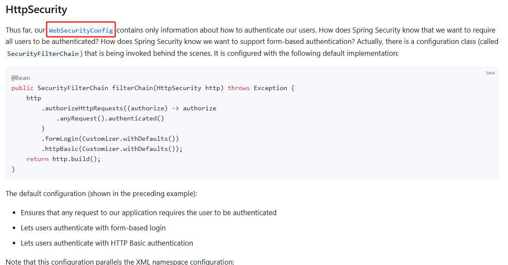
WebSecurityConfig中默认有下方代码的配置
```java
@Bean
public SecurityFilterChain filterChain(HttpSecurity http) throws Exception {
  //开启授权保护
  http.authorizeHttpRequests(
                  (authorize) -> authorize
                          //对所有请求开启授权保护
                          .anyRequest()
                          //已认证的请求会被自动授权
                          .authenticated()
          )
          //自动使用表单授权方式【注释后就没有html的登录页面了】
          .formLogin(Customizer.withDefaults())
          //基本授权方式【使用浏览器默认自带的登录】
          .httpBasic(Customizer.withDefaults());
  return http.build();
}
```
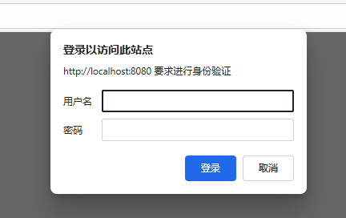

如果注释掉代码`.formLogin(Customizer.withDefaults())`，就会少三个过滤器。
如果写`.formLogin(Customizer.withDefaults()).httpBasic(Customizer.withDefaults());`，那么实际上`.httpBasic(Customizer.withDefaults())`是不生效的，可以注释掉。
```java
UsernamePasswordAuthenticationFilter,
DefaultLoginPageGeneratingFilter,
DefaultLogoutPageGeneratingFilter 
```

## 2.5 添加用户
1. 编写代码
  ```java
  @RestController
  @RequestMapping("/user")
  public class UserController {
    @Resource
    public UserService userService;
    
    @PostMapping("/add")
    public void add(@RequestBody User user) {
      userService.saveUserDetails(user);
    }
  }
  ```
  ```java
  public interface UserService extends IService<User> {
    void saveUserDetails(User user);
  }
  ```
  ```java
  @Service
  public class UserServiceImpl extends ServiceImpl<UserMapper, User> implements UserService {
  
    @Resource
    public DBUserDetailsManager dbUserDetailsManager;
  
    @Override
    public void saveUserDetails(User user) {
  
      UserDetails userDetails = org.springframework.security.core.userdetails.User
          .withDefaultPasswordEncoder()
          .username(user.getUsername())
          .password(user.getPassword())
          .roles("USER").build();
      dbUserDetailsManager.createUser(userDetails);
    }
  }
  ```
  ```java
  @Component
  public class DBUserDetailsManager implements UserDetailsManager, UserDetailsPasswordService {
  
    //引入持久层
    @Resource
    private UserMapper userMapper;
  
    @Override
    public UserDetails updatePassword(UserDetails user, String newPassword) {
      return null;
    }
  
    /**
     * 向数据库中插入新的用户信息.
     *
     * @param userDetails 用户信息
     */
    @Override
    public void createUser(UserDetails userDetails) {
      //实现数据插入
      User user = new User();
      user.setUsername(userDetails.getUsername());
      user.setPassword(userDetails.getPassword());
      user.setEnabled(true);
  
      userMapper.insert(user);
  
    }
  
    @Override
    public void updateUser(UserDetails user) {
  
    }
  
    @Override
    public void deleteUser(String username) {
  
    }
  
    @Override
    public void changePassword(String oldPassword, String newPassword) {
  
    }
  
    @Override
    public boolean userExists(String username) {
      return false;
    }
  
    /**
     * 通过用户名从数据库中获取用户信息.
     *
     * @param username 用户名
     * @return UserDetails对象
     * @throws UsernameNotFoundException
     */
    @Override
    public UserDetails loadUserByUsername(String username) throws UsernameNotFoundException {
      QueryWrapper<User> queryWrapper = new QueryWrapper<>();
      queryWrapper.eq("username", username);
      User user = userMapper.selectOne(queryWrapper);
      if (user == null) {
        throw new UsernameNotFoundException(username);
      } else {
        Collection<GrantedAuthority> authorities = new ArrayList<>();
        //组装security中的user对象
        return new org.springframework.security.core.userdetails.User(
            user.getUsername(),
            user.getPassword(),
            user.getEnabled(),
            true, //用户账号是否过期
            true, //用户凭证是否过期
            true, //用户是否未被锁定
            authorities //权限列表【暂时先创建空的】
        );
      }
  
    }
  }
  ```

2. 使用swagger测试

- 引入依赖
  ```xml
  <!--swagger测试-->
  <dependency>
    <groupId>com.github.xiaoymin</groupId>
    <artifactId>knife4j-openapi3-jakarta-spring-boot-starter</artifactId>
    <version>4.1.0</version>
  </dependency>
  ```
- 进入url`localhost:8080/demo/doc.html`进行调试。
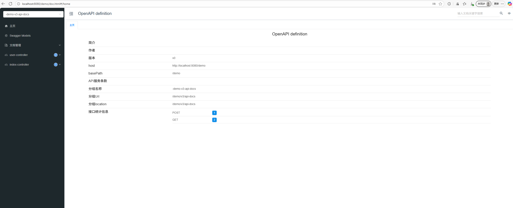
spring security默认开启了对跨站攻击CSRF的防御，在登录页的源码中可以查看到。
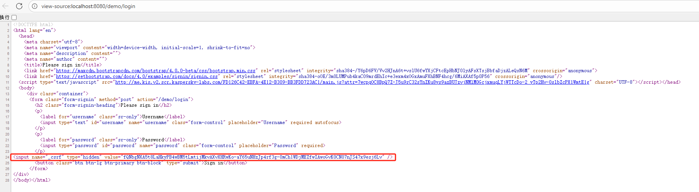
代码`http.csrf(csrf -> csrf.disable());`，可以关闭CSRF防御，关闭后页面代码中就没有了这段代码：
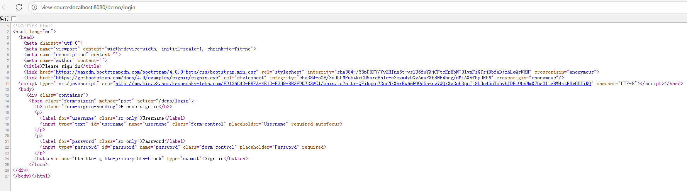
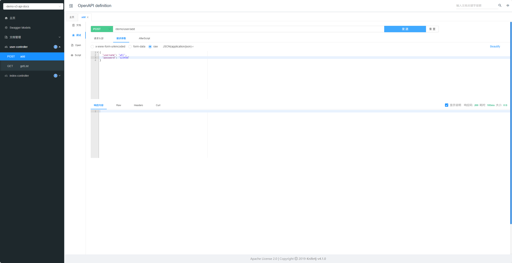
测试成功
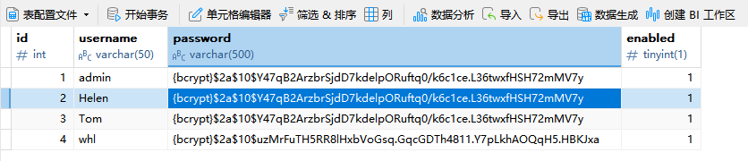

## 2.6 密码加密算法
### 2.6.1 密码加密方式
- 明文密码： 最初，密码以明文形式存储在数据库中。但是恶意用户可能会通过SQL注入等手段获取到明文密码，或者程序员将数据库数据泄露的情况也可能发生。
- Hash算法：SpringSecurity的`PasswordEncoder`接口用于对密码进行单向转换，从而将密码安全地存储。密码单向转换需要用到`哈希算法`，例如：MD5、SHA-256、SHA-512等，哈希算法是单向的，`只能加密，不能解密`。因此，`数据库中存储的是单向转换后的密码`，Spring Security在进行用户身份验证时需要将用户输入的密码进行单向转换，然后与数据库的密码进行比较。因此，如果发生数据泄露，只有密码的单向哈希会被暴露。由于哈希是单向的，并且在给定的情况下只能通过`暴力破解的方式猜测密码`。
- 彩虹表：恶意用户创建称为`彩虹表`的查找表。彩虹表就是一个庞大的、针对各种可能的字母组合预先生成的哈希值集合，有了它可以快速破解各类密码。越是复杂的密码，需要的彩虹表就越大，主流的彩虹表都是100G以上，目前主要的算法有LM、NTLM、MD5、SHA1、MYSQL SHA1、HALFMCHAL、NTLMCHALL、ORACLE-SYSTEM、MD5-HALF。
- 加盐密码：为了减轻彩虹表的效果，开发人员开始使用加盐密码。将盐和用户的密码一起经过哈希函数运算，生成一个唯一的哈希，盐将以明文的形式与用户的密码一起存储。
- 自适应单向函数：随着硬件的发展，加盐哈希也不再安全，因为计算机可以每秒执行数十亿次哈希计算。因此，开始使用自适应单向函数来存储密码，这种函数可以通过增加计算成本来抵御暴力破解攻击。常见的自适应单向函数包括BCrypt、PBKDF2和SCrypt。自适应单向函数允许配置一个“工作因子”，随着硬件的改进而增加，建议将“工作因子”调整到系统中验证密码需要约一秒钟的时间。

### 2.6.2 PasswordEncoder
BCryptPasswordEncoder：Spring Security默认的加密方式
  - `PasswordEncoder encoder = new BCryptPasswordEncoder(4);`，这里参数4代表工作因子，默认值是10，最小值是31，值越大运算速度越慢。

### 2.6.3 密码加密测试
```java
@org.junit.jupiter.api.Test
void testPassword() {
  PasswordEncoder encoder = new BCryptPasswordEncoder(4);
  String encode = encoder.encode("123456");
  System.out.println(encode);

  //密码校验
  Assert.isTrue(encoder.matches("123456", encode), "密码校验失败");
}
```

### 2.6.4 DelegatingPasswordEncoder
观察源码：

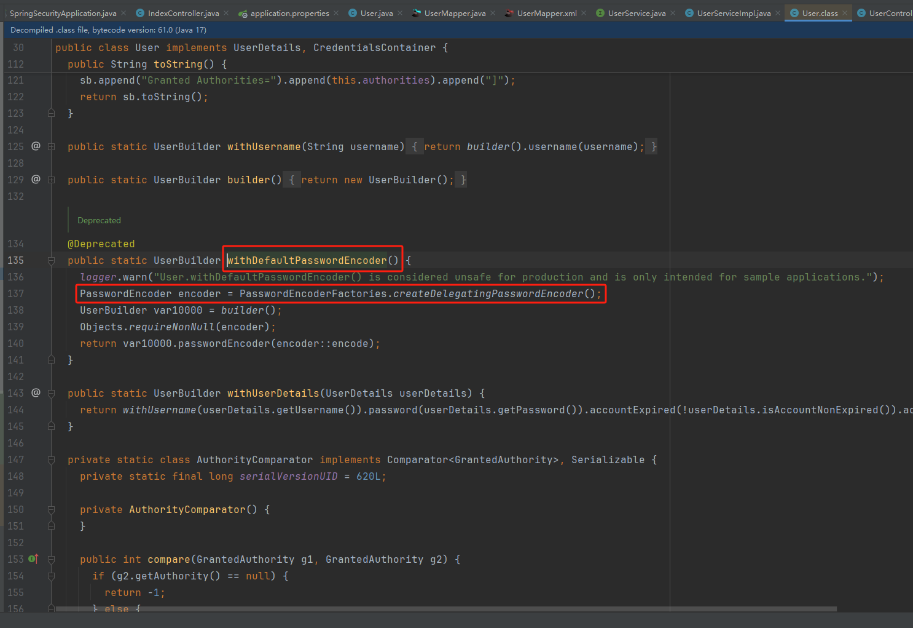
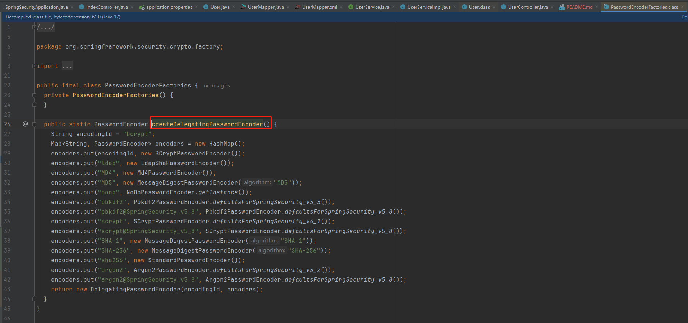
matches方法将输入的密码和加密后的密码做比对。


## 2.7 自定义登录页面
- 控制器（LoginController）
```java
package com.whl.security.controller;

import org.springframework.stereotype.Controller;
import org.springframework.web.bind.annotation.GetMapping;

@Controller
public class LoginController {

  @GetMapping("/login")
  public String login() {
    return "login";
  }

}

```
- 登录前端代码（Login.html）
```html
<!DOCTYPE html>
<html xmlns:th="https://www.thymeleaf.org">
<head>
    <title>登录</title>
</head>
<body>
<h1>登录</h1>
<div th:if="${param.error}">
    错误的用户名和密码.</div>
<!--method必须为"post"-->
<!--th:action="@{/login}",
使用动态参数，表单中会自动生成_csrf隐藏字段，用于防止csrf攻击
login: 和登录页面保持一致即可，SpringSecurity自动进行登录认证-->
<form th:action="@{/login}" method="get">
    <div>
        <!--name必须为"username"-->
        <input type="text" name="username" placeholder="用户名"/>
    </div>
    <div>
        <!--name必须为"password"-->
        <input type="password" name="password" placeholder="密码">
    </div>
    <input type="submit" value="登录">
</form>
</body>
</html>
```

自定义的登录页面，需要删除`.formLogin(Customizer.withDefaults())`中的默认代码，否则会使用默认的登录页面。
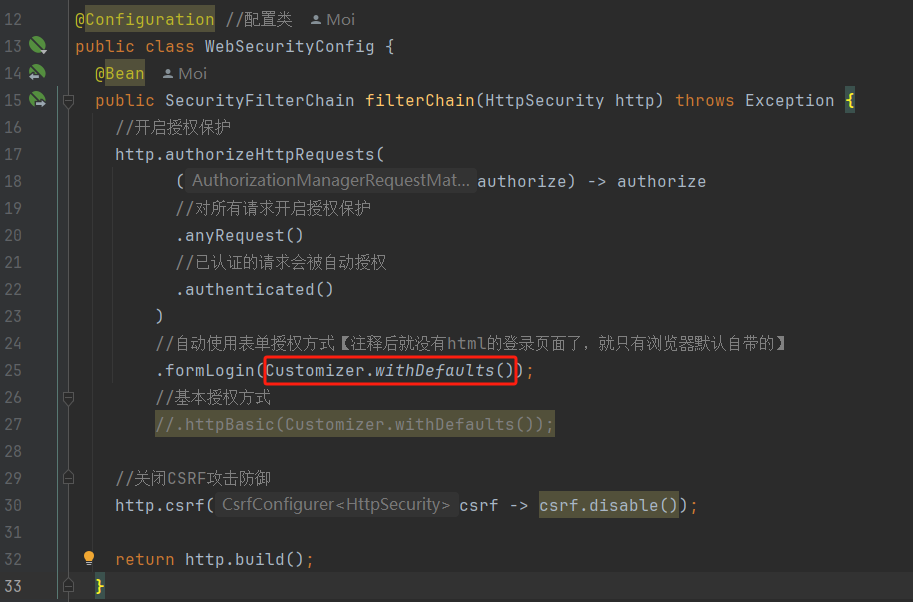
修改为：
```java
@Configuration //配置类
public class WebSecurityConfig {
  @Bean
  public SecurityFilterChain filterChain(HttpSecurity http) throws Exception {
    //开启授权保护
    http.authorizeHttpRequests(
          (authorize) -> authorize
          //对所有请求开启授权保护
          .anyRequest()
          //已认证的请求会被自动授权
          .authenticated()
        )
        //自动使用表单授权方式【注释后就没有html的登录页面了，就只有浏览器默认自带的】
        .formLogin(form -> {
          form.loginPage("/login");
        });
        //基本授权方式
        //.httpBasic(Customizer.withDefaults());

    //关闭CSRF攻击防御
    http.csrf(csrf -> csrf.disable());

    return http.build();
  }
}
```

结果得到：
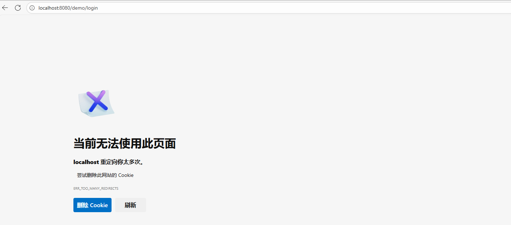

这是因为，开启自定义登陆页后默认的过滤器就失效了，这段代码会使得对所有的请求都开启授权保护，就会使得，请求login的时候需跳转到login进行授权保护，层层迭代死循环了。
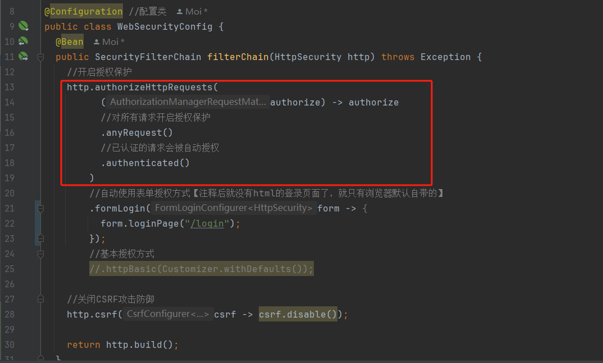
就会使得重定向的次数过多，需要加一层代码，无需授权就可以访问登录页。
```java
@Configuration //配置类
public class WebSecurityConfig {
  @Bean
  public SecurityFilterChain filterChain(HttpSecurity http) throws Exception {
    //开启授权保护
    http.authorizeHttpRequests(
                    (authorize) -> authorize
                            //对所有请求开启授权保护
                            .anyRequest()
                            //已认证的请求会被自动授权
                            .authenticated()
            )
            //自动使用表单授权方式【注释后就没有html的登录页面了，就只有浏览器默认自带的】
            .formLogin(form -> {
              form.loginPage("/login").permitAll();
            });
    //基本授权方式
    //.httpBasic(Customizer.withDefaults());

    //关闭CSRF攻击防御
    http.csrf(csrf -> csrf.disable());

    return http.build();
  }
}
```
注意，LoginController要用`Controller`而不是`RestController`，否则会返回json数据，而不是页面。

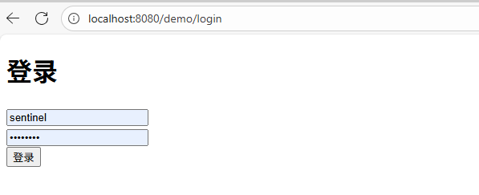

如果前端html文件中，不想用username和password来表示账号密码，可以在配置类中定义：
```java
@Configuration //配置类
public class WebSecurityConfig {
  @Bean
  public SecurityFilterChain filterChain(HttpSecurity http) throws Exception {
    //开启授权保护
    http.authorizeHttpRequests(
          (authorize) -> authorize
          //对所有请求开启授权保护
          .anyRequest()
          //已认证的请求会被自动授权
          .authenticated()
        )
        //自动使用表单授权方式【注释后就没有html的登录页面了，就只有浏览器默认自带的】
        .formLogin(form -> {
          form.loginPage("/login").permitAll()
            .usernameParameter("myusername")//配置自定义的表单用户名参数，默认值是username
            .passwordParameter("mypassword")//配置自定义的表单密码参数，默认值是password
          ;
        });
        //基本授权方式
        //.httpBasic(Customizer.withDefaults());

    //关闭CSRF攻击防御
    http.csrf(csrf -> csrf.disable());

    return http.build();
  }
}
```
```html
<!DOCTYPE html>
<html xmlns:th="https://www.thymeleaf.org">
<head>
    <title>登录</title>
</head>
<body>
<h1>登录</h1>
<div th:if="${param.error}">
    错误的用户名和密码.</div>
<!--method必须为"post"-->
<!--th:action="@{/login}",
使用动态参数，表单中会自动生成_csrf隐藏字段，用于防止csrf攻击
login: 和登录页面保持一致即可，SpringSecurity自动进行登录认证-->
<form th:action="@{/login}" method="get">
    <div>
        <!--name必须为"username"-->
        <input type="text" name="myusername" placeholder="用户名"/>
    </div>
    <div>
        <!--name必须为"password"-->
        <input type="password" name="mypassword" placeholder="密码">
    </div>
    <input type="submit" value="登录">
</form>
</body>
</html>
```

配置，得到
```java
@Configuration //配置类
public class WebSecurityConfig {
  @Bean
  public SecurityFilterChain filterChain(HttpSecurity http) throws Exception {
    //开启授权保护
    http.authorizeHttpRequests(
          (authorize) -> authorize
          //对所有请求开启授权保护
          .anyRequest()
          //已认证的请求会被自动授权
          .authenticated()
        )
        //自动使用表单授权方式【注释后就没有html的登录页面了，就只有浏览器默认自带的】
        .formLogin(form -> {
          form.loginPage("/login").permitAll()
            .usernameParameter("myusername")
            .passwordParameter("mypassword")
            .failureUrl("/login?error")//校验失败时跳转
          ;
        });
        //基本授权方式
        //.httpBasic(Customizer.withDefaults());

    //关闭CSRF攻击防御
    http.csrf(csrf -> csrf.disable());

    return http.build();
  }
}
```
修改`.failureUrl("/login?error")`中的url值，错误后跳转的url也会发生变化。
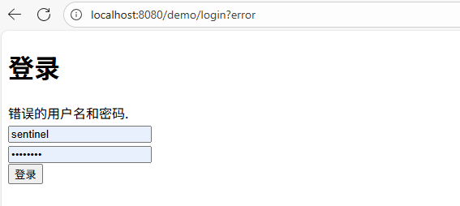

前端表单中用到了`th:`，就能生成动态的参数，能够拼接自定义的url前缀，否则写死后，就无法找到
```html
<form th:action="@{/login}" method="post">
    <div>
        <!--name必须为"username"-->
        <input type="text" name="myusername" placeholder="用户名"/>
    </div>
    <div>
        <!--name必须为"password"-->
        <input type="password" name="mypassword" placeholder="密码">
    </div>
    <input type="submit" value="登录">
</form>
```

# OAuth2.0
简单理解，就是在不提供密码的情况下获得授权访问受限资源。

## 1. 获得授权的方式
- 授权码
- 隐藏式
- 密码式
- 客户端凭证
